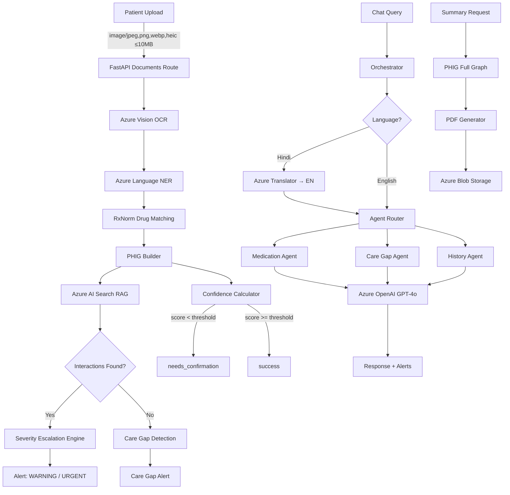

# CareOrbit MVP — 6-Sprint TDD Implementation Plan v0.3.0

**Date:** March 2026 | **Methodology:** Test-Driven Development (RED → GREEN → REFACTOR)
**Backend:** Python 3.12 + FastAPI 0.111.0 | **DB:** Azure PostgreSQL + pgcrypto + SQLAlchemy 2.0.30 async

---

## Architecture Data Flow

---

## Sprint 1: Infrastructure + Authentication

**Goal:** JWT auth, bcrypt passwords, pgcrypto PII encryption, append-only audit trail, rate limiting, refresh token rotation, change-password endpoint

**Azure Services:** PostgreSQL (pgcrypto), Key Vault

**Key Modules:**
- `api/routes/auth.py` — register, login, refresh, logout, change-password
- `api/middleware/auth.py` — JWT creation, password hashing, token verification
- `api/middleware/audit.py` — append-only audit logging
- `api/middleware/rate_limit.py` — IP-based rate limiting
- `api/middleware/feature_gate.py` — tier-based feature gates
- `api/middleware/rbac.py` — role-based access control
- `models/user.py`, `models/refresh_token.py`, `models/audit_log.py`
- `utils/encryption.py` — pgcrypto helpers (encrypt_sql, get_encryption_params)
- `utils/tier_config.py` — TIER_LIMITS configuration
- `db/session.py` — async SQLAlchemy session factory
- `services/azure_keyvault.py` — AzureKeyVaultService wrapper
- `services/redis_store.py` — RedisRateLimitStore (rate limiting backing store)
- `config.py` — application settings

| Step | Order | File | Type | Azure Mock Used | Passes When |
|------|-------|------|------|-----------------|-------------|
| 1 | WRITE TEST | tests/unit/test_password_hashing.py | Unit | None | — |
| 2 | RUN (RED) | — | — | — | ImportError: api.middleware.auth |
| 3 | WRITE CODE | api/middleware/auth.py + config.py | Impl | — | — |
| 4 | RUN (GREEN) | — | — | — | 8 JWT + 5 password tests pass |
| 5 | WRITE TEST | tests/unit/test_encryption.py | Unit | async_session (Rule 4 exception) | — |
| 6 | RUN (RED) | — | — | — | ImportError: utils.encryption |
| 7 | WRITE CODE | utils/encryption.py | Impl | — | — |
| 8 | RUN (GREEN) | — | — | — | 6 encryption tests pass |
| 9 | WRITE TEST | tests/functional/test_api_auth.py | Functional | None (real TestClient) | — |
| 10 | RUN (RED) | — | — | — | ImportError: main |
| 11 | WRITE CODE | main.py + api/routes/auth.py + db/session.py + models/ | Impl | — | — |
| 12 | RUN (GREEN) | — | — | — | 16 auth tests pass |
| 13 | WRITE TEST | tests/security/test_rate_limiting.py | Security | None (real rate limiter) | — |
| 14 | RUN (RED) | — | — | — | Rate limiting not implemented |
| 15 | WRITE CODE | api/middleware/rate_limit.py + services/redis_store.py | Impl | — | — |
| 16 | RUN (GREEN) | — | — | — | 3 rate limit tests pass |
| 17 | WRITE TEST | tests/security/test_audit_trail.py | Security | async_session | — |
| 18 | RUN (RED) | — | — | — | ImportError: api.middleware.audit |
| 19 | WRITE CODE | api/middleware/audit.py + models/audit_log.py | Impl | — | — |
| 20 | RUN (GREEN) | — | — | — | 8 audit tests pass |
| 21 | WRITE TEST | tests/security/test_audit_append_only.py | Security | async_session | — |
| 22 | RUN (GREEN) | — | — | — | 4 audit append-only tests pass |
| 23 | WRITE TEST | tests/security/test_rbac_enforcement.py | Security | auth middleware | — |
| 24 | RUN (RED) | — | — | — | RBAC routes not yet wired |
| 25 | WRITE CODE | api/middleware/rbac.py | Impl | — | — |
| 26 | RUN (GREEN) | — | — | — | 3 RBAC tests pass |
| 27 | WRITE TEST | tests/security/test_rbac_permission_levels.py | Security | auth + rbac middleware | — |
| 28 | RUN (GREEN) | — | — | — | 4 permission boundary tests pass |
| 29 | WRITE TEST | tests/security/test_cross_patient_rbac.py | Security | auth + rbac middleware | — |
| 30 | RUN (GREEN) | — | — | — | 6 cross-patient isolation tests pass |
| 31 | WRITE TEST | tests/security/test_refresh_token_security.py | Security | async_session | — |
| 32 | RUN (RED) | — | — | — | Missing create_refresh_token |
| 33 | WRITE CODE | Refresh token rotation in auth.py | Impl | — | — |
| 34 | RUN (GREEN) | — | — | — | 5 token security tests pass |
| 35 | WRITE TEST | tests/security/test_password_change_revocation.py | Security | async_session | — |
| 36 | RUN (GREEN) | — | — | — | 3 revocation tests pass |
| 37 | WRITE TEST | tests/business_logic/test_tier_config.py | Business | None (pure config) | — |
| 38 | RUN (RED) | — | — | — | ImportError: utils.tier_config |
| 39 | WRITE CODE | utils/tier_config.py + api/middleware/feature_gate.py | Impl | — | — |
| 40 | RUN (GREEN) | — | — | — | 17 tier + feature gate tests pass |

---

## Sprint 2: Document Pipeline

**Goal:** Upload prescription/lab/strip images, Azure Vision OCR, Language NER → RxNorm mapping, PHIG node creation, Blob Storage, state machine with terminal statuses only (success, needs_confirmation, failed)

**Azure Services:** Document Intelligence (Vision), Language (NER), Blob Storage

**Key Modules:**
- `api/routes/documents.py` — upload endpoint with MIME/size validation
- `pipeline/document_pipeline.py` — 5-state processing lifecycle
- `graph/phig_builder.py` — PHIG node creation
- `graph/confidence.py` — ConfidenceCalculator with source ceilings
- `services/azure_vision.py` — AzureVisionService wrapper
- `services/azure_language.py` — AzureLanguageService wrapper
- `services/azure_blob.py` — AzureBlobService wrapper
- `utils/drug_database.py` — DrugDatabase with Indian brand mapping

| Step | Order | File | Type | Azure Mock Used | Passes When |
|------|-------|------|------|-----------------|-------------|
| 1 | WRITE TEST | tests/unit/test_confidence_scoring.py | Unit | None (pure logic) | — |
| 2 | RUN (RED) | — | — | — | ImportError: graph.confidence |
| 3 | WRITE CODE | graph/confidence.py | Impl | — | — |
| 4 | RUN (GREEN) | — | — | — | 19 confidence tests pass |
| 5 | WRITE TEST | tests/unit/test_drug_database.py | Unit | None (pure logic) | — |
| 6 | RUN (RED) | — | — | — | ImportError: utils.drug_database |
| 7 | WRITE CODE | utils/drug_database.py | Impl | — | — |
| 8 | RUN (GREEN) | — | — | — | 18 drug database tests pass |
| 9 | WRITE TEST | tests/functional/test_api_documents.py | Functional | document_pipeline | — |
| 10 | RUN (RED) | — | — | — | No /api/documents/upload route |
| 11 | WRITE CODE | api/routes/documents.py + pipeline/document_pipeline.py | Impl | — | — |
| 12 | RUN (GREEN) | — | — | — | 6 upload tests pass |
| 13 | WRITE TEST | tests/functional/test_api_documents_boundaries.py | Functional | document_pipeline | — |
| 14 | RUN (GREEN) | — | — | — | 7 boundary tests pass |
| 15 | WRITE TEST | tests/integration/test_document_state_machine.py | Integration | AzureVisionService, AzureOpenAIService | — |
| 16 | RUN (RED) | — | — | — | DocumentPipeline not yet complete |
| 17 | WRITE CODE | Complete pipeline + services/azure_vision.py + services/azure_blob.py + services/azure_language.py | Impl | — | — |
| 18 | RUN (GREEN) | — | — | — | 7 state machine tests pass |

---

## Sprint 3: Drug Interaction + Care Gap Engine

**Goal:** PHIG drug interaction detection via Azure AI Search RAG, severity escalation for renal impairment (creatinine > 1.3, eGFR < 60), care gap detection, patient confirmation flow (0.85 hardcoded score)

**Azure Services:** Azure AI Search (hybrid keyword + vector)

**Key Modules:**
- `services/azure_search.py` — AzureSearchService wrapper
- `graph/phig_builder.py` — interaction checking + care gap detection
- `graph/confidence.py` — ceiling enforcement
- `api/routes/patients.py` — overview, medications, labs, care_gaps
- `api/routes/confirmations.py` — patient confirmation (0.85 score)

| Step | Order | File | Type | Azure Mock Used | Passes When |
|------|-------|------|------|-----------------|-------------|
| 1 | WRITE TEST | tests/functional/test_api_confirmations.py | Functional | auth middleware | — |
| 2 | RUN (RED) | — | — | — | No /api/confirmations route |
| 3 | WRITE CODE | api/routes/confirmations.py | Impl | — | — |
| 4 | RUN (GREEN) | — | — | — | 5 confirmation tests pass |
| 5 | WRITE TEST | tests/false_positive_negative/test_interaction_false_positives.py | FP | AzureSearchService | — |
| 6 | RUN (RED) | — | — | — | phig_builder interaction checks incomplete |
| 7 | WRITE CODE | Complete phig_builder interaction engine + services/azure_search.py | Impl | — | — |
| 8 | RUN (GREEN) | — | — | — | FP wiring + algorithm tests pass |
| 9 | WRITE TEST | tests/false_positive_negative/test_interaction_false_negatives.py | FN | AzureSearchService | — |
| 10 | RUN (GREEN) | — | — | — | FN wiring + detection tests pass (critical) |

---

## Sprint 4: AI Chat + Multi-Agent Orchestrator

**Goal:** Medication/CareGap/History agents, Hindi ↔ English translation via Azure Translator, GPT-4o chat, health readiness endpoint

**Azure Services:** Azure OpenAI (GPT-4o), Azure Translator

**Key Modules:**
- `services/azure_openai.py` — AzureOpenAIService wrapper
- `services/azure_translator.py` — AzureTranslatorService wrapper (httpx internally)
- `agents/orchestrator.py` — multi-agent router
- `agents/medication_agent.py` — drug interaction queries
- `agents/care_gap_agent.py` — screening gap queries
- `agents/history_agent.py` — medical history queries (P0-15)
- `api/routes/chat.py` — chat query endpoint
- `api/routes/health.py` — GET /health readiness probe

| Step | Order | File | Type | Azure Mock Used | Passes When |
|------|-------|------|------|-----------------|-------------|
| 1 | WRITE TEST | tests/integration/test_orchestrator.py | Integration | AzureOpenAIService, AzureTranslatorService, AzureSearchService | — |
| 2 | RUN (RED) | — | — | — | ImportError: agents.orchestrator |
| 3 | WRITE CODE | agents/orchestrator.py + agents/medication_agent.py + agents/care_gap_agent.py + agents/history_agent.py | Impl | — | — |
| 4 | RUN (GREEN) | — | — | — | 6 orchestrator tests pass |
| 5 | WRITE CODE | api/routes/chat.py + services/azure_openai.py + services/azure_translator.py | Impl | — | — |
| 6 | WRITE TEST | tests/functional/test_api_health.py | Functional | None | — |
| 7 | RUN (RED) | — | — | — | No /health endpoint |
| 8 | WRITE CODE | api/routes/health.py | Impl | — | — |
| 9 | RUN (GREEN) | — | — | — | 5 health endpoint tests pass |

---

## Sprint 5: Summaries + Reminders + Subscriptions + Caregivers + Tier Gates

**Goal:** PDF health summary generation, reminder CRUD with RBAC, tier gate enforcement, email reminders via Azure Communication Services, Service Bus for async delivery, caregiver management, adherence tracking, lab trends

**Azure Services:** Azure Communication Services (Email), continued Blob + OpenAI

**Key Modules:**
- `api/routes/summary.py` — GET /api/summary/generate (PDF response)
- `api/routes/reminders.py` — CRUD: create, list, delete
- `api/routes/caregivers.py` — add, delete (idempotent), list views
- `api/routes/subscriptions.py` — current tier, plans, upgrade (demo)
- `api/routes/adherence.py` — adherence tracking (P0-17)
- `api/routes/labs.py` — lab trends (P0-16)
- `services/azure_email.py` — AzureEmailService wrapper
- `services/azure_servicebus.py` — AzureServiceBusQueue (async reminder delivery)
- `utils/pdf_generator.py` — PDF generation
- `graph/lab_trends.py` — lab trend calculation
- Scheduler module for reminder email delivery

| Step | Order | File | Type | Azure Mock Used | Passes When |
|------|-------|------|------|-----------------|-------------|
| 1 | WRITE TEST | tests/functional/test_api_summary.py | Functional | phig_builder, pdf_generator, AzureBlobService | — |
| 2 | RUN (RED) | — | — | — | No /api/summary route |
| 3 | WRITE CODE | api/routes/summary.py + utils/pdf_generator.py | Impl | — | — |
| 4 | RUN (GREEN) | — | — | — | 5 summary tests pass |
| 5 | WRITE TEST | tests/functional/test_api_reminders.py | Functional | auth + rbac | — |
| 6 | RUN (RED) | — | — | — | No /api/reminders route |
| 7 | WRITE CODE | api/routes/reminders.py + services/azure_email.py + services/azure_servicebus.py | Impl | — | — |
| 8 | RUN (GREEN) | — | — | — | 12 reminder tests pass |
| 9 | WRITE TEST | tests/functional/test_api_caregivers.py | Functional | auth middleware | — |
| 10 | RUN (RED) | — | — | — | No /api/caregivers route |
| 11 | WRITE CODE | api/routes/caregivers.py | Impl | — | — |
| 12 | RUN (GREEN) | — | — | — | 10 caregiver tests pass |
| 13 | WRITE TEST | tests/functional/test_api_subscriptions.py | Functional | auth + session | — |
| 14 | RUN (GREEN) | — | — | — | 10 subscription tests pass |
| 15 | WRITE TEST | tests/regression/test_lab_trend_edge_cases.py | Regression | None | — |
| 16 | RUN (RED) | — | — | — | ImportError: graph.lab_trends |
| 17 | WRITE CODE | graph/lab_trends.py | Impl | — | — |
| 18 | RUN (GREEN) | — | — | — | 4 lab trend tests xfail→xpass |

---

## Sprint 6: Frontend + E2E

**Goal:** React + Vite patient dashboard, backend E2E Ramesh journey, coverage matrix verification, Playwright browser tests

**Azure Services:** Azure Static Web Apps (deployment)

**Key Modules:**
- `tests/e2e/test_patient_journey_ramesh.py` — complete 9-step E2E journey
- `tests/coverage_matrix.py` — P0/P1 coverage verification (17 P0 + 1 P1)
- Frontend: React 18 + Vite 5 + Tailwind CSS 3.4 + Zustand + TanStack Query v5
- Dashboard components: medication list, interaction alerts, care gaps, lab trends, reminders, chat

| Step | Order | File | Type | Azure Mock Used | Passes When |
|------|-------|------|------|-----------------|-------------|
| 1 | WRITE TEST | tests/e2e/test_patient_journey_ramesh.py | E2E | All 7 service mocks | — |
| 2 | RUN (RED) | — | — | — | Route integration gaps |
| 3 | FIX WIRING | Integration fixes across all routes | Impl | — | — |
| 4 | RUN (GREEN) | — | — | — | 9-step Ramesh journey passes |
| 5 | WRITE TEST | tests/coverage_matrix.py | Coverage | None (pure assertions) | — |
| 6 | RUN (GREEN) | — | — | — | P0 count = 17, all have tests |
| 7 | WRITE CODE | Frontend React + Vite dashboard | Frontend | — | — |
| 8 | WRITE TEST | Playwright browser tests | E2E | — | Dashboard renders correctly |
| 9 | RUN (GREEN) | — | — | — | Full CI pipeline passes |

---

## Test File Summary

| # | File | Directory | Sprint |
|---|------|-----------|--------|
| 01 | helpers/mocks.py | tests/helpers/ | Pre |
| 02 | conftest.py | tests/ | Pre |
| 03 | test_confidence_scoring.py | tests/unit/ | 2 |
| 04 | test_drug_database.py | tests/unit/ | 2 |
| 05 | test_encryption.py | tests/unit/ | 1 |
| 06 | test_password_hashing.py | tests/unit/ | 1 |
| 07 | test_api_auth.py | tests/functional/ | 1 |
| 08 | test_api_documents.py | tests/functional/ | 2 |
| 09 | test_api_documents_boundaries.py | tests/functional/ | 2 |
| 10 | test_api_confirmations.py | tests/functional/ | 3 |
| 11 | test_api_caregivers.py | tests/functional/ | 5 |
| 12 | test_api_summary.py | tests/functional/ | 5 |
| 13 | test_api_reminders.py | tests/functional/ | 5 |
| 14 | test_api_subscriptions.py | tests/functional/ | 5 |
| 15 | test_api_health.py | tests/functional/ | 4 |
| 16 | test_document_state_machine.py | tests/integration/ | 2 |
| 17 | test_orchestrator.py | tests/integration/ | 4 |
| 18 | test_rate_limiting.py | tests/security/ | 1 |
| 19 | test_refresh_token_security.py | tests/security/ | 1 |
| 20 | test_audit_trail.py | tests/security/ | 1 |
| 21 | test_audit_append_only.py | tests/security/ | 1 |
| 22 | test_rbac_enforcement.py | tests/security/ | 1 |
| 23 | test_rbac_permission_levels.py | tests/security/ | 1 |
| 24 | test_cross_patient_rbac.py | tests/security/ | 1 |
| 25 | test_password_change_revocation.py | tests/security/ | 1 |
| 26 | test_tier_config.py | tests/business_logic/ | 1 |
| 27 | test_interaction_false_positives.py | tests/false_positive_negative/ | 3 |
| 28 | test_interaction_false_negatives.py | tests/false_positive_negative/ | 3 |
| 29 | test_lab_trend_edge_cases.py | tests/regression/ | 5 |
| 30 | test_patient_journey_ramesh.py | tests/e2e/ | 6 |
| 31 | coverage_matrix.py | tests/ | 6 |

**Total: 31 files | ~880+ test functions | 17 P0 + 1 P1 features**
